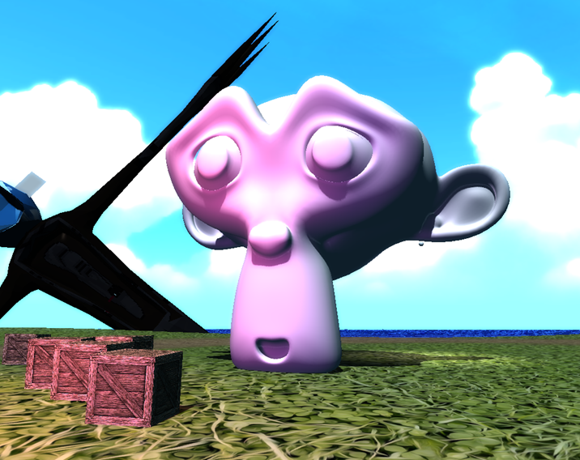
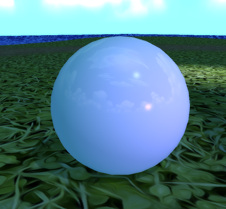
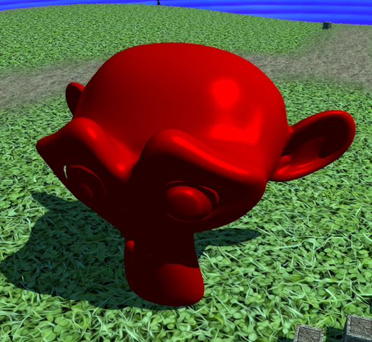
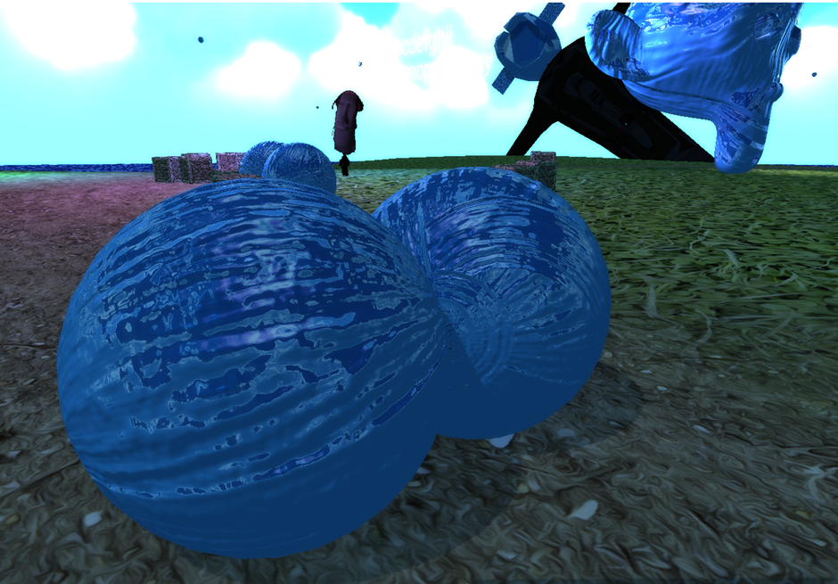
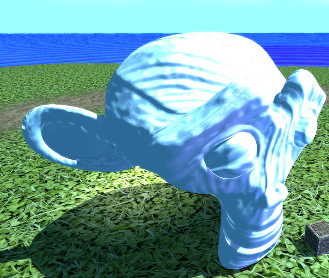

# C++ Game Engine
C++ Game Engine ist ein Projekt, das ich als Game-Engine und Showcase entwickelt habe, geschrieben in C++ mit OpenGL als Grafik-API.
In meinem Studium haben wir gelernt, Rendering von Grund auf mit OpenGL und C++ zu erstellen, aber später mussten wir für die Aufgabe auf C# umsteigen.
Da ich aber schon viel C# konnte und unbedingt C++ lernen wollte, bekam ich die Erlaubnis, das Projekt in C++ zu schreiben.
Statt nur einen einfachen Renderer zu bauen, habe ich gleich eine kleine Game-Engine drumherum entwickelt, auch wenn der Fokus auf dem Rendering lag.

## Features

### Rendering
Die Engine verwendet OpenGL fürs Rendering.

#### Lighting
Das Rendering unterstützt ein Umgebungslicht, ein Directional-Light und bis zu 16 Point-Lights.


Highlights werden mit der Blinn-Methode umgesetzt, die für Directional- und Point-Lights funktioniert.



#### Shading
Die Engine unterstützt auch Smooth- und Metallic-Shading, wobei das nur eine Annäherung ist und kein echtes Physically-Based Rendering (PBR).


<p style="margin-top: -2rem"><i>Specular tint with metallic set to 0%</i></p>



<p style="margin-top: -2rem"><i>Specular tint with metallic set to 100%</i></p>

#### Reflections
Je nach smoothness des Materials wird die Skybox reflektiert.


<p style="margin-top: -2rem"><i>smoothness 100% | metallic 0%</i></p>


<p style="margin-top: -2rem"><i>smoothness 100% | metallic 100%</i></p>


<p style="margin-top: -2rem"><i>smoothness 50% | metallic 50%</i></p>

#### Normal Maps
Normal Maps werden unterstützt und interagieren korrekt mit den Lichteffekten.





#### Shadows
Schatten werden durch eine Cascaded-Shadow-Map umgesetzt, die sich je nach Winkel des Richtungslichts anpasst.


#### Material System
Das Rendering-System basiert auf einem Material-System, wie man es auch in anderen Engines findet. 
Jedes Material hat vordefinierte Parameter, die man nachträglich anpassen kann.

```cpp

UniformStorage commonUniforms = UniformStorage();
commonUniforms.InitializeUniform<float>("u_Time", 0.0f, false);
commonUniforms.InitializeUniform<glm::mat4>("u_Transform", glm::identity<glm::mat4>(), false);

UniformStorage litUniforms = UniformStorage();
litUniforms.InitializeUniform<float>("u_Smoothness", 0.0f);
litUniforms.InitializeUniform<float>("u_Metallicness", 0.0f);
litUniforms.InitializeUniform<Texture2D*>("u_NormalMap", GET_TEXTURE_2D(NormalMapDefault));
litUniforms.InitializeUniform<CubeMap*>("u_SkyboxCubeMap", GET_CUBEMAP(SkyBox));

Shader* litShader = ADD_SHADER(Lit, new Shader("res/shaders/Lit/Lit.vert", "res/shaders/Lit/Lit.frag"));
litShader->GetUniformStorage()->CopyFrom(&commonUniforms);
litShader->GetUniformStorage()->CopyFrom(&litUniforms);

```

#### Batched Sprite Renderer
Die Engine unterstützt 2D- und 3D-Sprites.
Sprites werden registriert und in einen Texture-Atlas geladen, sodass sie alle im selben Draw-Call gerendert werden, wenn sie zur gleichen Atlas-Seite gehören.
Das erlaubt eine große Anzahl von Sprites, die effizient gerendert werden können.

### Physics
Die Engine verwendet [ReactPhysics3D](https://www.reactphysics3d.com) als Physik-Engine.

::auto-video{src="../media/physics.mp4"}
::

### Audio
Für die Audio-Integration wird die FMOD Core API verwendet.

### UI
[ImGui](https://github.com/ocornut/imgui) ist für die Benutzeroberfläche integriert, was es mir erlaubt, den gesamten Szenenbaum anzuzeigen. 
Die Werte von Game-Objekten und deren Komponenten, inklusive Material-Parameter, lassen sich direkt im UI anpassen.

::auto-video{src="../media/ui.mp4"}
::

### Input
Die Eingabe ist ziemlich einfach gehalten und wird über eine einzelne statische Klasse verwaltet, die prüft, ob eine Taste gedrückt oder gehalten wird.

### Game Object Management
Das Game-Objekt-Management ähnelt dem von Unity: 
Es gibt Game-Objekte, die Komponenten enthalten können, und die Komponenten haben vordefinierte Funktionen wie OnStart und OnUpdate, um Logik auszuführen.
Jedes Game-Objekt lebt in einer Szene und hat immer eine Transform-Komponente.

```cpp
GameObject* playerObject = new GameObject("Player");
playerObject->GetTransform()->SetLocalPosition(glm::vec3(0.0f, 7.0f, 0.0f));

playerObject->AddComponent(new CapsuleCollider());
playerObject->AddComponent(new Rigidbody());
playerObject->AddComponent(new CharacterController());
playerObject->AddComponent(new POVCharacterController());
playerObject->AddComponent(new MeshRenderer(GET_MODEL(Cube)->GetMesh(0), GET_MATERIAL(Crate)));

void POVCharacterController::OnStart() 
{ 
    _characterController = _gameObject->GetComponent<CharacterController>(); 
}
```

## Reflexion

### Was ich gelernt habe

#### OpenGL
Das war mein erster Kontakt mit OpenGL und mein erstes Mal, einen Renderer von Grund aufzuschreiben.
Ich habe dabei viel über die Rendering-Pipeline gelernt, die von Engines normalerweise abstrahiert wird.
Ich habe herausgefunden, wie Vertex-Daten strukturiert, in Shader übergeben und dort manipuliert werden.
Zusätzlich musste ich mich auch intensiv mit Matrizen beschäftigen, da sie die grundlegenden Bausteine fürs Rendering sind.

#### C++
Das war auch mein erstes Mal mit C++, also war die Sprache komplett neu für mich.
Vieles in der Syntax kam mir aus C# bekannt vor, aber Sachen wie Header, Pointer, manuelles Speichermanagement und Mehrfachvererbung waren mir völlig fremd.
Die Trennung zwischen Header- und Quell-Dateien fand ich etwas nervig – ich verstehe, warum es so gemacht wird, aber es fühlt sich manchmal redundant an.
Ein weiteres Aha-Erlebnis war, dass nicht initialisierte Variablen wirklich zufälligen Speicher enthalten und nicht automatisch auf Standardwerte gesetzt werden, wie es in anderen Sprachen oft der Fall ist.

### Dinge, die besser sein könnten

#### Dependencies
Ein großer Unterschied zwischen C++ und anderen Sprachen ist der Mangel an einem standardisierten Paketmanager.
Es gibt zwar Drittanbieter-Lösungen wie VCPKG und Conan, aber die sind nicht ganz leicht zugänglich, und ich hatte nicht die Zeit, mich da tiefer einzuarbeiten.
Letztendlich habe ich die Abhängigkeiten manuell verwaltet, was sich als schlechte Idee herausstellte und das Ganze unnötig kompliziert machte.
Für mein nächstes Projekt werde ich definitiv nach besseren Möglichkeiten zur Verwaltung der Abhängigkeiten suchen.

#### Separation
Aufgrund meiner Art, die Abhängigkeiten zu verwalten, war es nicht möglich, den Showcase von der Engine zu trennen,
und beide befinden sich nun im gleichen Git-Repository, was nicht ideal ist.

#### Codequalität
Die Codequalität könnte definitiv besser sein, aber da dies mein erstes Projekt in C++ war, war das zu erwarten.
Ich habe in diesem Projekt viel gelernt und werde das Wissen in meinem nächsten C++-Projekt nutzen, um den Code sauberer und effizienter zu schreiben.

#### Quantität über Qualität
Die Engine hat viele Features – manche habe ich noch nicht mal erwähnt, wie z.B. das SDF-Text-Rendering.
Viele dieser Features sind jedoch nur teilweise implementiert und ein wenig buggy.
Bei zukünftigen Projekten sollte ich mich wahrscheinlich darauf konzentrieren, vorhandene Funktionen zu verfeinern, statt so viele wie möglich hinzuzufügen.

## Resultate

### Source Code
Das Projekt ist vollständig Open Source und verfügbar hier: [https://github.com/xWinuX/CppGameEngine](https://github.com/xWinuX/CppGameEngine) \
Der Showcase ist unter der Release Sektion verfügbar oder hier: [https://github.com/xWinuX/CppGameEngine/releases/download/v1.0/CppGameEngineV1.0.zip](https://github.com/xWinuX/CppGameEngine/releases/download/v1.0/CppGameEngineV1.0.zip)

### Note
Die Endnote war eine 2 (University of Middlesex Notensystem), was auf der Schweizer Notenskala einer 5.75 entspricht.

