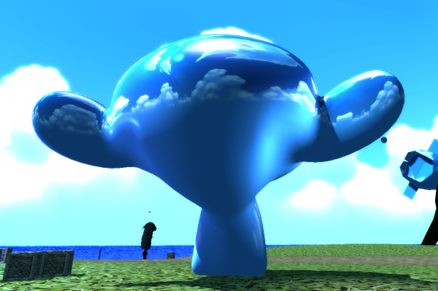

# C++ Game Engine
C++ Game Engine is a project I developed as both a game engine and a showcase, written in C++ with OpenGL as the graphics API. 
During my studies, we learned to create rendering from scratch with OpenGL and C++, though we later switched to C# for the assignment. 
Since I already knew a lot of C# but wanted to learn C++, I got permission to do the project in C++ instead.
Rather than just building a simple renderer, I ended up creating a small game engine around it, with the main focus still on rendering.

## Features

### Rendering
The engine uses OpenGL for rendering.

#### Lighting
It supports one ambient light, one directional light, and up to 16 point lights.


I used the Blinn method for highlights, which works for both directional and point lights.


#### Shading
The engine also supports smooth and metallic shading, though this is just an approximation and isn’t based on PBR.


<p style="margin-top: -1rem"><i>Specular tint with metallic set to 0%</i></p>


<p style="margin-top: -1rem"><i>Specular tint with metallic set to 100%</i></p>

#### Reflections
Depending on the material’s smoothness, the skybox can be reflected on surfaces.


<p style="margin-top: -1rem"><i>smoothness 100% | metallic 0%</i></p>


<p style="margin-top: -1rem"><i>smoothness 100% | metallic 100%</i></p>


<p style="margin-top: -1rem"><i>smoothness 50% | metallic 50%</i></p>

#### Normal Maps
Normal maps are supported and interact correctly with lighting effects.


#### Shadows
Shadows are handled via a cascaded shadow map and adjust based on where the directional light is pointing.


#### Material System
The rendering system is built on a material system, similar to other engines. 
Each material’s parameters need to be initialized but can be changed as needed.

```cpp

UniformStorage commonUniforms = UniformStorage();
commonUniforms.InitializeUniform<float>("u_Time", 0.0f, false);
commonUniforms.InitializeUniform<glm::mat4>("u_Transform", glm::identity<glm::mat4>(), false);

UniformStorage litUniforms = UniformStorage();
litUniforms.InitializeUniform<float>("u_Smoothness", 0.0f);
litUniforms.InitializeUniform<float>("u_Metallicness", 0.0f);
litUniforms.InitializeUniform<Texture2D*>("u_NormalMap", GET_TEXTURE_2D(NormalMapDefault));
litUniforms.InitializeUniform<CubeMap*>("u_SkyboxCubeMap", GET_CUBEMAP(SkyBox));

Shader* litShader = ADD_SHADER(Lit, new Shader("res/shaders/Lit/Lit.vert", "res/shaders/Lit/Lit.frag"));
litShader->GetUniformStorage()->CopyFrom(&commonUniforms);
litShader->GetUniformStorage()->CopyFrom(&litUniforms);

```

#### Batched Sprite Renderer
The engine includes support for 2D and 3D sprites.
Sprites get registered and go into a texture atlas, so when multiple sprites are rendered, they’re all drawn in the same draw call if they share the same texture atlas page.
This allows for a lot of sprites to be rendered efficiently.


### Physics
[ReactPhysics3D](https://www.reactphysics3d.com) is used as the physics engine.  

::auto-video{src="../media/physics.mp4"}
::

### Audio
The FMOD Core API is integrated for audio.

### UI
[ImGui](https://github.com/ocornut/imgui) is integrated for the UI, allowing me to display the entire scene tree.
Game objects and their components, including material parameters, can be adjusted directly in the UI.
The whole scene tree is displayed in the UI, and values of game objects and their components can be changed, including values of materials.

::auto-video{src="../media/ui.mp4"}
::

### Input
Input handling is straightforward, managed by a single static class that lets you check if a key is pressed or held.

### Game Object Management
Game object management is similar to Unity's system: there are game objects that can have components,
and components have predefined functions like OnStart and OnUpdate for executing logic.
Each game object lives in a scene and always contains a transform component.

```cpp
GameObject* playerObject = new GameObject("Player");
playerObject->GetTransform()->SetLocalPosition(glm::vec3(0.0f, 7.0f, 0.0f));

playerObject->AddComponent(new CapsuleCollider());
playerObject->AddComponent(new Rigidbody());
playerObject->AddComponent(new CharacterController());
playerObject->AddComponent(new POVCharacterController());
playerObject->AddComponent(new MeshRenderer(GET_MODEL(Cube)->GetMesh(0), GET_MATERIAL(Crate)));

void POVCharacterController::OnStart() 
{ 
    _characterController = _gameObject->GetComponent<CharacterController>(); 
}
```

## Reflection

### What I learned

#### OpenGL
This was my first time using OpenGL and writing a renderer from scratch.
I learned a lot about the rendering pipeline, which engines usually abstract away.
I figured out how vertex data is structured, passed into shaders, and manipulated.
I also had to dive into matrices, which are essential building blocks for rendering anything.

#### C++
This was my first time working with C++, so everything about the language was new.
A lot of the syntax felt similar to C#, but things like headers, pointers, manual memory management, and multiple inheritance were completely new to me.
I found the header/source file separation a bit annoying.
I get why it’s done this way, but it felt redundant at times.
Another surprise was that uninitialized variables really just contain random memory, unlike other languages where you might get a default value.

### Things that could be better

#### Dependencies
One big difference between C++ and other languages is the lack of a standard package manager.
There are third-party solutions like VCPKG and Conan, but they’re a bit tough to get into, and I didn’t have time to dive deeply into them.
I ended up managing dependencies manually, which turned out to be a bad idea and made things harder than necessary.
For my next project, I’ll definitely look into better ways to manage dependencies.

#### Separation
Because of how I managed dependencies, I couldn’t separate the showcase from the engine, so both ended up in the same Git repository, which isn’t ideal.

#### Code Quality
The code quality could definitely be improved, but since it was my first time using C++, this was to be expected.
I learned a lot through the project and will use this experience to write cleaner code in my next C++ project.

#### Quantity over Quality
The engine includes a lot of features—some of which I haven’t even mentioned, like SDF text rendering.
But many of them are only partially implemented and a bit buggy.
For future projects, I should probably focus on refining what I already have rather than trying to add as much as possible.

## Results

### Source Code
The project is fully open source and available here: [https://github.com/xWinuX/CppGameEngine](https://github.com/xWinuX/CppGameEngine) \
The showcase is also available in the release section or here: [https://github.com/xWinuX/CppGameEngine/releases/download/v1.0/CppGameEngineV1.0.zip](https://github.com/xWinuX/CppGameEngine/releases/download/v1.0/CppGameEngineV1.0.zip)

### Grade
The final grade was a 2 (University of Middlesex grading scale), which is equivalent to a 5.75 on the Swiss grading scale.

