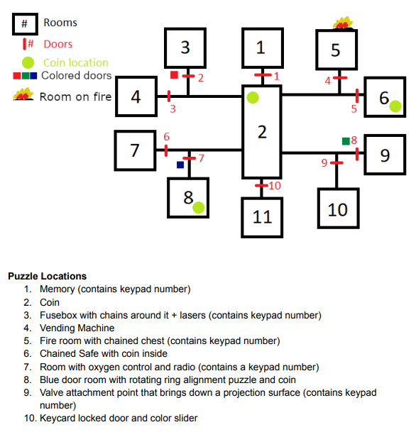

# Escape Loop
Escape Loop war das erste Spiel, an dem ich arbeitete, bei dem ich nicht der einzige Programmierer war.
Das Projekt war ein Gruppenprojekt in meinem Studium, bei dem es darum ging, in einer Gruppe von drei bis vier Personen ein kleines Spiel zu entwickeln.
Es beinhaltete auch die Erstellung und Präsentation der Spielidee, so wie man es bei einem Publisher tun würde.
Meine Aufgabe bestand natürlich aus der Programmierung und zusätzlich aus der Erstellung der meisten Modelle sowie sämtlicher Musik/SFX für das Spiel.
Ein vollständiger Playthrough kann im Video unterhalb angesehen werden, oder man kann das Spiel selbst spielen mit dem Link am Ende dieser Seite.

::youtube-embed{videoId="KiYrEAXpeh8"}
::

## Features
In Escape Loop steckt man auf einem Raumschiff fest, das auf Kollisionskurs mit einem Schwarzen Loch ist.
Bevor das jedoch geschieht, springt die Zeit auf mysteriöse Weise fünf Minuten in die Vergangenheit zurück.
der Fluchtweg ist durch ein Keypad gesperrt, dessen Code man nicht kennt.
Jede Zahl ist irgendwo auf dem Raumschiff versteckt, aber man hat nur 5 Minuten Zeit, bis alles zurückgesetzt wird.
Die Aufgabe ist es, in jedem Loop so viele Informationen wie möglich herauszufinden und diese Informationen im nächsten Loop zu verwenden, um noch mehr Informationen zu finden.
Während man das tut, muss man seine Bewegung in der Schwerelosigkeit steuern.
Jeder kleine Schlag könnte einem durch die Luft schleudern und irgendwohin rotieren lassen.

::auto-video{src="../media/movement.mp4"}
::

Man macht im Raumschiff Fortschritt, indem man verschiedene Puzzles löst.

::auto-video{src="../media/puzzles.mp4"}
::

Einige davon lassen sich nur mit Informationen lösen, die in vorherigen Schleifen gesammelt wurden, und einige benötigen Hinweise aus der Umgebung.

::auto-video{src="../media/hints.mp4"}
::

## Reflexion

### Was ich gelernt habe

#### Die Zusammenarbeit mit mehreren Programmierern an einem Spiel
Das war das erste Mal, dass ich mit mehreren Programmierern an einem Spiel gearbeitet habe.
Bisher als ich in einer Gruppe an Spielen arbeitete, waren alle Rollen immer getrennt und wurden nicht geteilt, also habe ich immer alleine programmiert, der Artist hat alleine die
Grafiken gemacht usw ...
Mit guter Projektplanung und der Verwendung eines Kanban-Boards lässt sich jede Aufgabe klar definieren, sodass es keine Konflikte gibt, wenn mehrere Personen gleichzeitig
programmieren.
Das Schwierige war, sicherzustellen, dass alle eine gleichmässige Arbeitsbelastung hatten, da nicht alle die gleiche Zeit zur Verfügung hatten.

#### Richtige Levelplanung
Da wir ein Game Design Document (GDD) erstellen mussten, mussten wir auch das gesamte Level und alle Puzzles planen.
Es war eine Menge Arbeit, den gesamten Plan zusammenzustellen, aber letztendlich hat er uns sehr geholfen und die Entwicklung und das Leveldesign deutlich beschleunigt.

### Was besser sein könnte

#### Bessere Aufgabenverteilung
Wir haben die Aufgaben nicht ganz fair verteilt, daher hatten manche mehr Arbeit als nötig und andere zu wenig.
Beim nächsten Mal sollten wir die Aufgabenverteilung wahrscheinlich viel ausführlicher besprechen, bevor wir sie tatsächlich verteilen.

## Resultate

### Download
Das Spiel kann hier: [https://ragtonia-studios.itch.io/escape-loop](https://ragtonia-studios.itch.io/escape-loop) heruntergeladen werden.

### Note
Die Endnote war eine 3 (University of Middlesex Notensystem), was auf der Schweizer Notenskala einer 5.6 entspricht.
