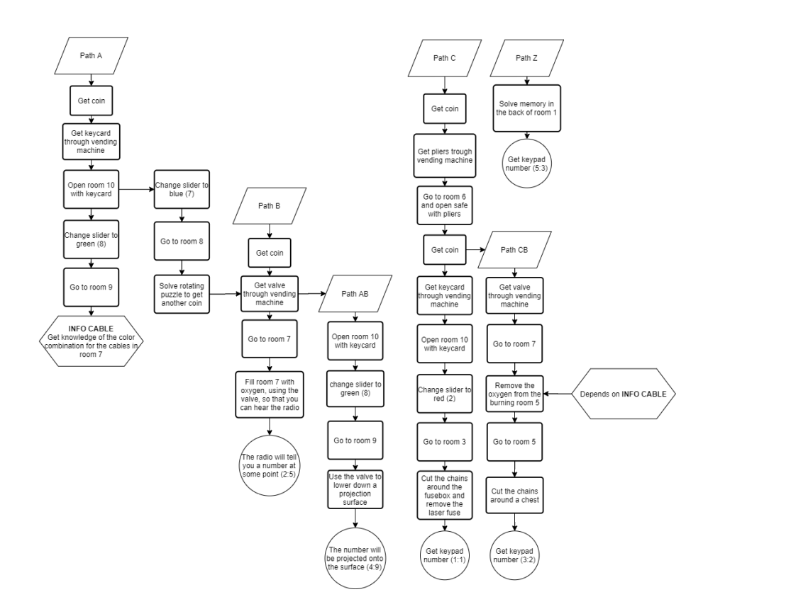
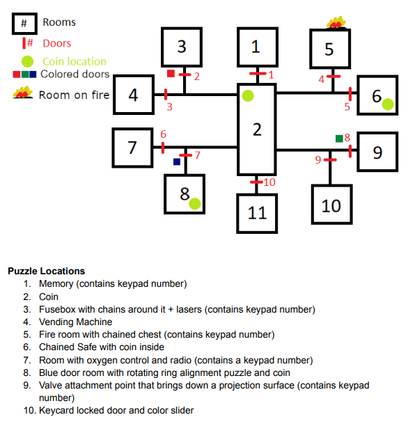

# Escape Loop
Escape Loop is the first time I worked on a game where I wasn't the only programmer.
The project was a group project in my studies where the goal was to make a small game in a group of three to four people.
It also contained making and pitching the game idea like you would to a publisher.
My role was obviously programming and also making most of the models and all music/sfx for the game.
A full playthrough can be seen in the video below, or you can play it yourself with the link at the bottom of the page.

::youtube-embed{videoId="KiYrEAXpeh8"}
::

## Features
In Escape Loop you’re stuck on a spaceship in a collision course with a black hole. However, before that happens, time mysteriously loops back 5 minutes to the past.
Your escape hatch is locked by a keypad you don't know the code for, every number is hidden somewhere on the spaceship, but you only have 5 minutes until everything resets.
Your job is to figure out as much as you can each loop and use that information in the next loop to find even more information.
While you're doing that, you also have to manage your movement in zero gravity. 
Every little bump could send you flying and rotating of somewhere.

::auto-video{src="../media/movement.mp4"}
::

You progress through the spaceship by solving various different puzzles.

::auto-video{src="../media/puzzles.mp4"}
::

Some of them you can only solve with information gathered in previous loops, and some require some environmental hints.

::auto-video{src="../media/hints.mp4"}
::

## Reflection

### What I learned

#### Working with multiple programmers on a game
This was my first time working with multiple programmers on a game.
Previously when I worked on games in a group, every role was always separated and not shared, so I did the programming alone, the artist did art alone etc...
With proper project planning and usage of a kanban board, each task could be defined clearly so that there aren't any conflicts when multiple people are coding at once.
What was pretty hard was making sure everybody had an equal workload since we didn't all have the same amount of time available.

#### Proper level planning
Since we had to make a game design document (GDD), we also had to plan the entire level and all the puzzles.
It was a lot of work to put together the entire plan, but in the end it helped us a lot and made development and level design a lot faster.

### Things that could be better

#### Better distribution of tasks
We didn't quite distribute all tasks fairly, so some people had more work to do than they should and some didn't have enough.
Next time we should probably discuss task distribution a lot more before actually distributing them.

## Results

### Download
The game can be downloaded here: [https://ragtonia-studios.itch.io/escape-loop](https://ragtonia-studios.itch.io/escape-loop)

### Grade
The final grade was a 3 (University of Middlesex grading scale), which is equivalent to a 5.6 on the Swiss grading scale.

