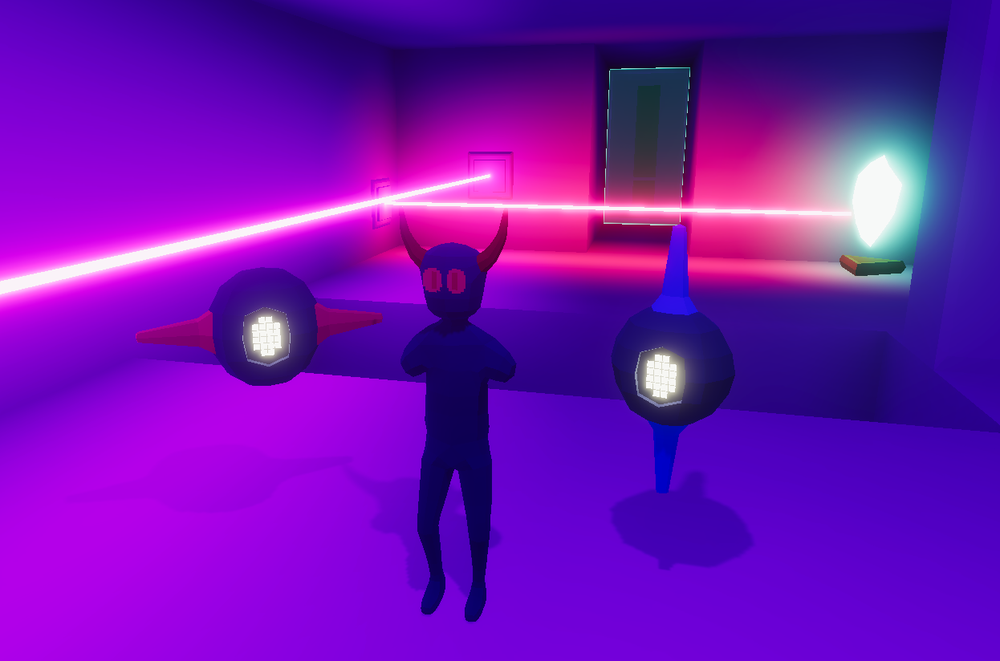

# Lux Machina 3D
Lux Machina 3D ist ein 3D-"Remake" von Lux Machina, einem Spiel, das ich für den 28. GM48 Game Jam entwickelt habe.
Es war mein erster Versuch, ein 3D-Spiel zu erstellen, und auch mein erster Einsatz von Unity.
Ausserdem war es das erste richtige Projekt in meinem Studium das benotet wurde.
Ein vollständiger Playthrough kann im Video unterhalb angesehen werden, oder man kann das Spiel selbst spielen mit dem Link am Ende dieser Seite.

::youtube-embed{videoId="rHljpWTegm4"}
::

## Features
Das Spiel enthält die meisten Mechaniken des ursprünglichen Game-Jam-Spiels, nur diesmal in 3D. 
Der größte Unterschied besteht darin, dass das Spiel, wenn man als Hauptcharakter spielt, 
jetzt aus der First-Person-Perspektive statt aus der Vogelperspektive wie im Original gespielt wird.

::auto-video{src="../media/first-person.mp4"}
::

Bei der Steuerung des Roboters wechselt das Spiel in eine Third-Person-Perspektive, um die Steuerung und Überblick der Laser zu erleichtern.
Die Steuerung des Roboters hat sich ebenfalls etwas verändert.
Er kann nun durch Drücken von Space/Shift auf-/absteigen und durch Drücken von E/Q drehen.

::auto-video{src="../media/new-robot-controls.mp4"}
::

## Reflexion

### Was ich gelernt habe

#### Unity
Das war mein erster Einsatz von Unity, daher musste ich natürlich alles Engine-spezifische Konzept von Grund auf neu lernen.
Die einzige Engine, die ich vorher benutzt habe, war Game Maker Studio, das etwas anders funktioniert als Unity.
Die Art und Weise, wie Unity Game Objects und Komponenten handhabt, war komplett neu für mich, aber ich mag die Flexibilität dieses Systems sehr.
Da Game Maker eigentlich nur für 2D verwendet wird, war es auch mein erstes 3D-Spiel.
Es macht die Dinge etwas schwieriger und zeitaufwendiger, insbesondere das Modellieren und Animieren von allem. \
\
Was mir an Unity wahrscheinlich am besten gefällt, ist die Möglichkeit, den Editor mit benutzerdefinierten Tools zu erweitern.
Ich habe im Laufe der Projektentwicklung einige kleinere Tools erstellt.
Wie dieses System, das mir anzeigt, welches Puzzle-Element aktiviert ist.

::auto-video{src="../media/puzzle-debug.mp4"}
::

Oder ein System, das die verschiedenen Level im Editor lädt.

::auto-video{src="../media/level-loading.mp4"}
::

#### Mehr C#
Ich habe schon vorher mit C# gearbeitet, aber das war das erste Mal, dass ich es in Kombination mit Unity verwendet habe.
Viele Vorkenntnisse konnte ich direkt übernehmen, aber ich musste trotzdem noch lernen, wie man die Unity API richtig verwendet.
Da Unity eine eher ältere C# Version braucht, waren nicht alle Features vorhanden, die ich bereits kenne.

#### Grundwissen von 3D modeling
Ich verwende beim Entwickeln nicht gerne Online-Asset-Packs. 
Wenn ich alleine arbeite, versuche ich daher immer noch, alles selbst zu machen.
Bei einem 3D-Spiel bedeutet das, 3D-Modelle zu erstellen, was ich vorher noch nie gemacht habe.
Also habe ich die Grundlagen von Blender und Rigging gelernt und die Modelle erstellt, die man im Spiel sehen kann.
Das Gesamtbild des Spiels wird stark von den Lichteffekten getragen, aber die Modelle, insbesondere die Roboter, sehen auch ziemlich gut aus.
Ich muss noch viel lernen, besonders in der Animation, da sie im Moment etwas steif aussehen, aber als erster Versuch hat es ziemlich gut funktioniert.

### Was besser sein könnte

#### Mehr content
Das Spiel hat nicht die gleiche Anzahl an Leveln wie die Originalversion, die in 48 Stunden erstellt wurde. 
Vieles davon ist darauf zurückzuführen, dass ich während des Erstellens noch zusätzlich Unity lernen musste und die zusätzliche Zeit, die die Erstellung von 3D-Modellen benötigt.
Es gibt viele verworfene Elemente, wie den zweiten Roboter aus dem Original oder Spiegel, die es nicht ins Spiel geschafft haben.

::auto-video{src="../media/reflections.mp4"}
::

Aber insgesamt, als mein erstes 3D/Unity-Spiel, ist es kein schlechter Start.

## Resultate

### Download
Das Spiel kann hier: [https://winux.itch.io/lux-machina-3d](https://winux.itch.io/lux-machina-3d) heruntergeladen werden. 

### Note
Die Endnote war eine 1 (University of Middlesex Notensystem), was auf der Schweizer Notenskala einer 6.0 entspricht.
