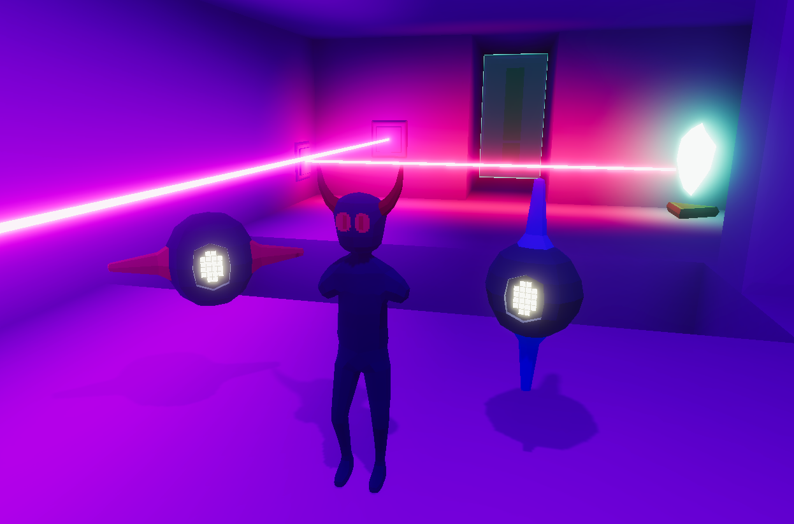

# Lux Machina 3D
Lux Machina 3D is a 3D "remake" of Lux Machina that was a game made for the 28th GM48 game jam.
It was my first time making a 3D game and also my first time using Unity.
Furthermore, it was the first real project in my studies that was graded.
A full playthrough can be seen in the video below, or you can play it yourself with the link at the bottom of the page.

::youtube-embed{videoId="rHljpWTegm4"}
::

## Features
The game contains most of the mechanics of the original game jam game, just in 3D this time.
The biggest difference is that when playing as the main character the game is now in a first person view instead of a top down view like the original.

::auto-video{src="../media/first-person.mp4"}
::

When controlling the robot, the game enters a third-person perspective to allow controlling lasers more easily.
The robot controls have also changed a bit. 
It can now ascend/descend by pressing Space/Shift and turn by pressing E/Q.

::auto-video{src="../media/new-robot-controls.mp4"}
::

## Reflection

### What I learned

#### Unity
This was my first time using Unity, so I obviously had to learn everything unique to the engine from scratch.
The only engine I previously used was Game Maker Studio, which functions a little differently from unity.
The way unity handles game objects and components was completely new for me, but I really like the flexibility that this system provides.
Since Game Maker is only really used for 2D, it was also my first time making a 3D game.
It makes things a bit harder and more time-consuming to do which especially modeling and animating everything. \
\
The thing I probably like the most about Unity is the way you can extend the editor with custom tooling.
I've created a bunch of tiny tools over the course of creating the project, like this system that shows me which puzzle element is activated.

::auto-video{src="../media/puzzle-debug.mp4"}
::

Or a system that loads the different levels in the editor.

::auto-video{src="../media/level-loading.mp4"}
::

#### More C#
I've used C# before, but this was the first time I've used it in combination with Unity.
A lot of previous knowledge could be transferred directly, but I still had to learn how to use the Unity API properly.
And also the fact that Unity uses quite an old version of C#, so not every new feature was available yet.

#### Basics of 3D modeling
I don't like to use online asset packs when making games, so when working alone, I still try to make everything myself.
For a 3D game this means making 3D models, which I've never done before.
So I learned the basics of blender and rigging and made the models you can see in the game.
The overall look of the game is heavily carried by the lighting effects, but the models, especially the robots, look quite good aswell.
I still have a lot to learn, especially in animation since they look a bit stiff right now, but as a first try it worked pretty well.

### Things that could be better

#### More content
The game doesn't have the same number of levels as the original version, which was made in 48 hours.
A lot of that can be attributed to figuring out how to use Unity and the additional amount of time it takes to make 3D models.
There's a lot of scrapped stuff like the second robot from the original or mirror reflections that didn’t make it into the game.

::auto-video{src="../media/reflections.mp4"}
::

But overall, as my first 3D/Unity game, it's not a bad start. 

## Results

### Download
The game can be downloaded here: [https://winux.itch.io/lux-machina-3d](https://winux.itch.io/lux-machina-3d)

### Grade
The final grade was a 1 (University of Middlesex grading scale), which is equivalent to a 6.0 on the Swiss grading scale.

