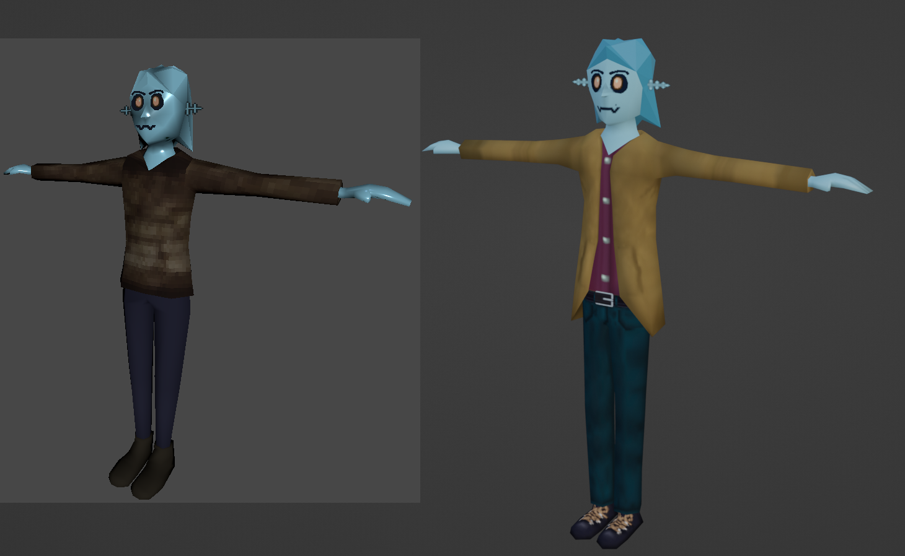
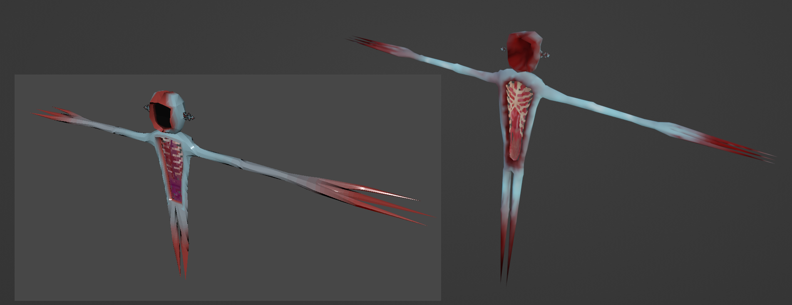
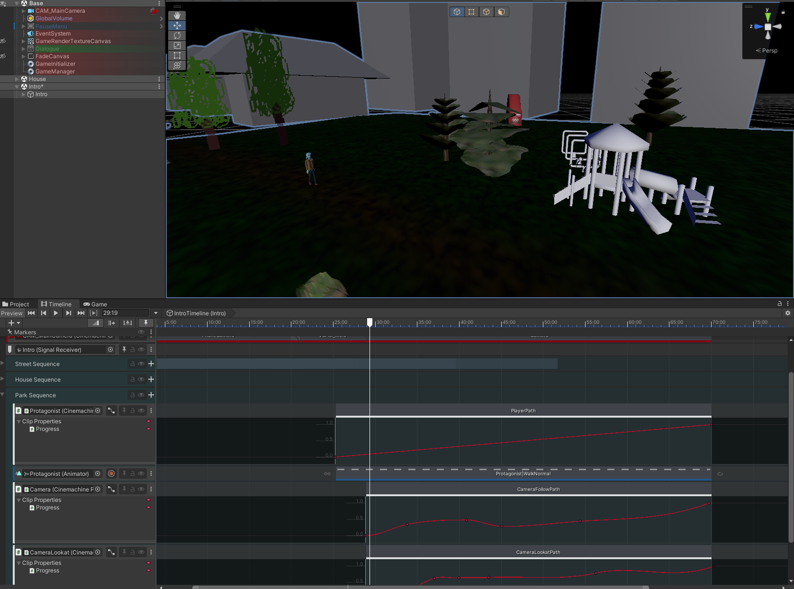

# Terrent Demo
Die Demo von Terrent wurde als Abschlussprojekt für die Diploma Stufe meines Studiums erstellt. 
Sie ist der erste Abschnitt eines viel grösseren Spiels, an dem ich derzeit arbeite. 
Ich habe alles programmiert und alle Modelle erstellt und ein Kollege von mir hat alles Audio-bezogene gemacht.
Wir haben auch gemeinsam an der Story und dem allgemeinen Game-Design gearbeitet.

Ein vollständiger Playthrough kann im Video unterhalb angesehen werden.

::youtube-embed{videoId="rHljpWTegm4"}
::

## Features
Du hast eine Weile nichts von Ihrem Bruder gehört und beschliessen, ihn zu besuchen. 
Doch als du ankommst, ist niemand da, und eine Reihe seltsamer Dinge geschehen, und dann bist du in seinem Haus gefangen.

Man kann nun jeden Raum, zu dem man Zugang hat, frei erkunden und versuchen herauszufinden, was wirklich passiert ist.
Man kann Gegenstände aufheben und ablegen, mit Türen und anderen Elementen in jedem Raum interagieren und in der Umgebung nach Hinweisen suchen.

Währenddessen kann man das Haus erkunden, können Events eintreten, die den Fortschritt schwerer machen oder einem einfach nur erschrecken sollen.

Das Spiel hat eine Auto-Speicherfunktion, die alles speichert, was man getan hat, einschliesslich der Türen, die man offen gelassen hat :)

## Reflexion

### Was ich gelernt habe

#### FMOD
Dies war mein erstes Projekt, in dem ich die [FMOD](https://www.fmod.com) Audio Middleware eingesetzt habe, und es hat mir sehr viel Spass gemacht. 
Es ermöglichte meinem Kollegen, Musik und Soundeffekte zu bearbeiten, ohne den Unity Editor öffnen zu müssen.
Es ist auch perfekt geeignet für Umgebungsgeräusche, da man zufällig ausgelöste Sounds wie beispielsweise knarrende Böden sehr einfach hinzufügen kann, ohne programmieren zu müssen.

### Was besser sein könnte

#### Steam Audio Integration
Neben FMOD habe ich auch [Steam Audio](https://valvesoftware.github.io/steam-audio/) für besseren räumlichen Sound integriert.
Aber ich habe diese Entscheidung letztendlich bereut, da die Integration in Unity zusammen mit FMOD sehr fehlerhaft war und viele Workarounds erforderte, um zum Laufen zu bringen.
Die Demo wurde dennoch damit released, aber ich habe es bald danach wieder entfernt.

#### Grafiken
Einige Modelle, Animationen und Texturen könnten besser aussehen.  
Ein paar davon wurden bereits behoben, aber es ist immer noch ein ziemliches Problem, aber ich lerne in diesem Bereich langsam immer mehr dazu.

## Resultate

### Note
Die Endnote war eine 3 (University of Middlesex Notensystem), was auf der Schweizer Notenskala einer 5.6 entspricht.

## Zukunft
Wie bereits erwähnt, arbeite ich immer noch an dem Spiel, obwohl der Fortschritt sehr langsam war, da ich andere Projekte für meinen Bachelor zu erledigen hatte.

Derzeit konzentriere ich mich sehr darauf, besser im Modellieren und Texturieren zu werden.
Daher habe ich sowohl den Protagonisten als auch das erste Monster neu erstellt.

Ich arbeite auch am Intro des Spiels, wofür ebenfalls viele Modelle, Animationen und auch neue Charaktere benötigt werden.

Das aktuelle Ziel ist es, die Demo zu überarbeiten und aufzubessern und dann zu entscheiden, wie es weitergeht.

