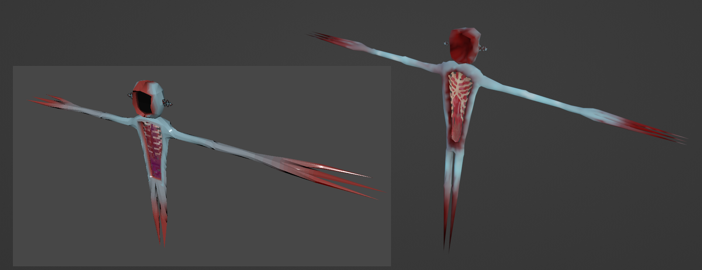
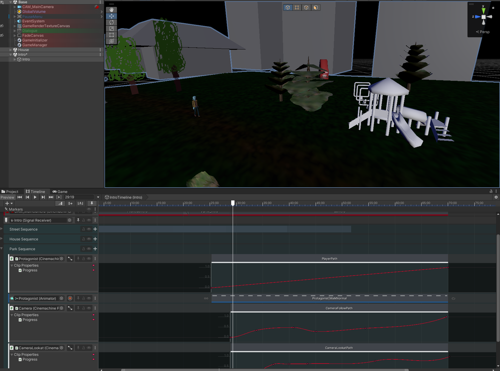

# Terrent Demo
The demo of Terrent was made as a final project for the diploma level of my studies.
It's the first section of a much bigger game I'm currently working on.
I coded everything and made all models, and a friend of mine made everything audio-related.
We also worked together on the story and overall game design.

A full playthrough can be seen in the video below.

::youtube-embed{videoId="21QgUA9LKYI"}
::

## Features
You haven't heard from your brother in a while and decide to go visit him. 
But when you get there, nobody is there, and a bunch of weird stuff happens, and then you're trapped inside his house.

You can now freely explore every room you have access to while trying to find out what really happened.
You can pick up and place items, interact with doors and other elements inside each room and look at the environment for hints.

While you explore the house, events can occur to hinder your progress or just scare you.

The game features an autosave feature that saves everything you did, including which doors you left open :)

## Reflection

### What I learned

#### FMOD
This was the first project where I used the [FMOD](https://www.fmod.com) audio middleware, and I really enjoyed it.
It allowed my friend to tune music and sfx without having to open the Unity Editor.
It's also really powerful for ambient sound effects since you can add randomly triggered sounds like floorboards creaking really easily with no coding required.

### Things that could be better

#### Steam Audio Integration
Besides FMOD I also integrated [Steam Audio](https://valvesoftware.github.io/steam-audio/) for better spacial audio.
But I regretted that decision in the end, because the integration in Unity together with FMOD was incredibly broken and required a lot of workarounds to get working.
The demo still shipped with it, but I removed it soon after.

#### Art
Some models, animations, and textures could look better. 
Some of them have already been fixed, but it is still quite a problem, but I'm slowly learning more and more in this area.

## Results

### Grade
The final grade was a 3 (University of Middlesex grading scale), which is equivalent to a 5.6 on the Swiss grading scale.

## Future
Like previously mentioned, I'm still working on the game, although progress has been really slow since I've had other projects to do for my bachelors. \
\
Currently, I'm really focusing on becoming better at modeling and texturing stuff. 
So I remade both the protagonist and the first monster.

I'm also working on the intro of the game, which also requires a lot of models, animation, and also new characters.

The current goal is to remake the demo into something more polished and then decide from there what to do next.

