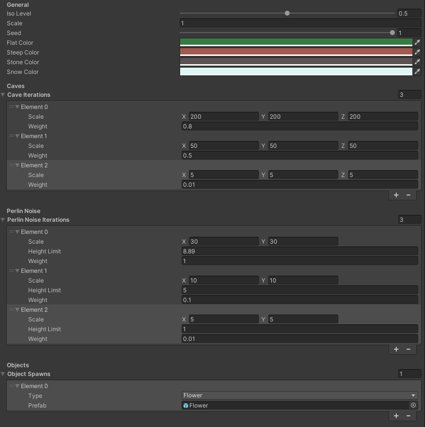

# Unity Tech Demos
Im folgenden Video sehen Sie eine Sammlung kleiner Tech-Demos, die ich für mein Studium erstellt habe.  
Der allgemeine Zweck dieser Demos war es, das Wissen über Mathematik in den Bereichen Simulation, KI-Verhalten und Terrain-Generation zu testen.
Ein Video jeder Demo, die ich erstellt habe, ist unten verfügbar.

::youtube-embed{videoId="ERUTLf83agc"}
::

## Features
Die Tech-Demos beinhalten Folgendes:
- Ein Custom Physik-System, das keine Unity-Rigidbodies verwendet.
- Insektenartiges Movement-System (kann an Wänden klettern)
- Marching Squares in 2D und 3D
- Cellular Automata
- Boids + Bienen-KI mit Boids
- Marching Cubes Terrain mit Chunking
- Einige Shader, die von Umwelteffekten wie Wind beeinflusst werden

### Physik-System
Das Physik-System verwendet Intersection Algorithmen entlang des Bewegungsvektors der Objekte, um Kollisionen zu prüfen. 
Allen Physikobjekten wird ein Physikmaterial zugewiesen, das deren Reibung und Sprungkraft beinhaltet.
Der Kollisionsauflöser löst dann Kollisionen, indem er die neuen Geschwindigkeiten aller kollidierenden Körper berechnet, sodass sie beispielsweise voneinander abprallen können. 
Die Simulation läuft in einer benutzerdefinierten Funktion ab, die ähnlich wie Unity's "FixedUpdate" in einem Fixed Time Step ausgeführt wird.

Das Physik-System beinhaltet auch Wind, der Objekte beeinflussen kann.

### Insektenartiges Movement-System
Die Bewegung des Insekts nutzt das Physik-System für die allgemeine Kollisionserkennung, verwendet dann aber eine Reihe von Raycasts, um zu berechnen, wie es an Wänden haften und
sich entlang dieser bewegen soll. 
Die Bewegung selbst funktioniert ziemlich gut, aber die verwendete Kamera ist wirklich nicht die beste und kann zu komischem Verhalten führen.

### Marching Squares
Der Marching-Squares-Algorithmus selbst war recht einfach zu implementieren, die Herausforderung lag eher im effizienten Erstellen des Meshes.
Er funktioniert für 2D- und 3D-Meshes (3D-Meshes erzeugen lediglich Wände an den Seiten der Flächen).

### Cellular Automata
Da Marching Squares ein Gitter von Zellen mit Daten benötigt, war die Implementierung einer Art zellulärer Automaten einfach. 
Ich habe es sogar durch die Verwendung von Scriptable Objects sehr erweiterbar gemacht, sodass man noch mehr hinzufügen konnte.
Für diese Demo habe ich nur Conway's Game of Life und einen zellularen Automaten zur Höhlengenerierung implementiert.

### Boids
Boids werden verwendet, um Schwarmintelligenz wie die von Vögeln oder Insekten zu simulieren.  
Boids sammeln Daten in ihrer Umgebung, einschliesslich der Daten anderer Boids, und nutzen diese, um sich in der Welt zu orientieren und um Hindernisse und andere Boids zu vermeiden.
Sie nutzen die Geschwindigkeit anderer Boids, um ihre eigene Geschwindigkeit anzupassen, sodass sie immer zusammenbleiben, aber niemals aufeinander prallen.

### Bienen-KI
Die Bienen-KI verwendet eine State Machine, um die verschiedenen Zustände zu verwalten, in denen sich Bienen befinden können.
Das Hauptziel der Bienen ist es, eine Blume ohne Biene zu finden, deren Nektar zu sammeln und dann zum Bienenstock zurückbringen.
Die Bienen kommunizieren dann untereinander darüber, welche Blüten sie besucht haben, um es anderen Bienen leichter zu machen, Blüten zu finden.
Wenn eine Wespe in ihren Aktionsradius eindringt, unterbrechen sie ihre Tätigkeit, um sie anzugreifen, und setzen ihre Arbeit fort, sobald sie verschwunden ist.

Die State Machine selbst ist recht einfach, aber trotzdem flexibel.
Es gibt Zustände, die verschiedene Funktionen haben, die der Zustandsautomat aufrufen kann.

```csharp
public interface IState
{
    void Tick();
    void OnEnter();
    void OnExit();
    IState SetOnEnterAction(Action action);
    IState SetOnExitAction(Action action);
}
```
In der State Machine kann der Benutzer dann Übergänge zwischen diesen Zuständen festlegen.  
Übergänge haben immer eine Bedingung, die erfüllt sein muss, um den Zustand zu wechseln. 
Übergänge können entweder zwischen allen Zuständen erfolgen, beispielsweise der Angriffs-Zustand der Biene, oder von einem Zustand in einen anderen, 
wie z.B. die Rückkehr zum Bienenstock nach dem Sammeln von Nektar.

### Marching Cubes
Das Marching-Cubes-Terrain ist vollständig zerstörbar und verwendet 3D-Chunks, um sich theoretisch in jede Richtung unendlich zu erstrecken. 
Das gesamte System nutzt Unity's Job-System und den Burst-Compiler, um einen möglichst hohe Performance zu gewährleisten.
Es verwendet ausserdem Scriptable Objects für seine Generierung, sodass es einfach modifiziert werden kann.



Da der Schwerpunkt mehr auf der Mesh-Generierung selbst lag, ist es ziemlich simpel aufgebaut, aber es funktioniert.

### Shaders
Viele der gezeigten Shader basieren auf vorherigen Projekten von mir. 
Die neuen sind der Regenpfützen-Shader, der Wasser-Shader und der Shader für das Gras.
Jeder dieser Shader wird von verschiedenen Parametern beeinflusst, wie dem Wind aus dem Physik-System und dem Regen aus dem Wetter-System.

## Reflexion

### Was ich gelernt habe

#### Marching Squares/Cubes
Dies war das erste Mal, dass ich diese Algorithmen verwendet habe.
Marching Squares war recht einfach, da die Lookup-Tabelle ziemlich klein ist,
aber Marching Cubes brauchte viel Zeit für die Implementierung und das anschliessende Debugging, weil das Chunking das Ganze deutlich schwieriger machte.

#### Boids
Die Implementierung von Boids erforderte viel Ausprobieren und Feintuning der Parameter, war aber ziemlich zufriedenstellend, als es schliesslich gut funktionierte. 
Das System ist sehr interessant, und ich habe bereits einige Ideen, wo ich es in zukünftigen Projekten einsetzen könnte.

### Dinge, die besser sein könnten

#### Demos mehr ausbauen
Da die Zeit begrenzt war, konnte ich nicht wirklich viel Zeit für jede einzelne Demo aufwenden.
Ich hätte einige gerne noch weiter ausgebaut.

#### Erstelle Demos, die ausserhalb des Unity-Editors "spielbar" sind
Um die Demos zu sehen und zu verwenden, benötigt man den Unity Editor.  
Es wäre besser gewesen, ein Menü zu haben, in dem man die verschiedenen Demos auswählen und sich diese dann ansehen kann. 
Mit einem solchen System könnte ich sogar einen Download anbieten, anstatt nur Videos.

## Resultate

### Note
Die Endnote war eine 2 (University of Middlesex Notensystem), was auf der Schweizer Notenskala einer 5.75 entspricht.

